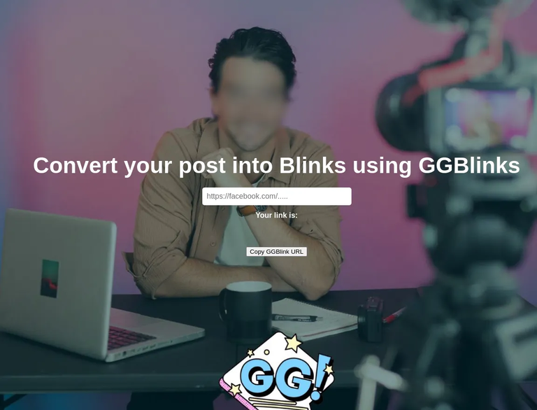
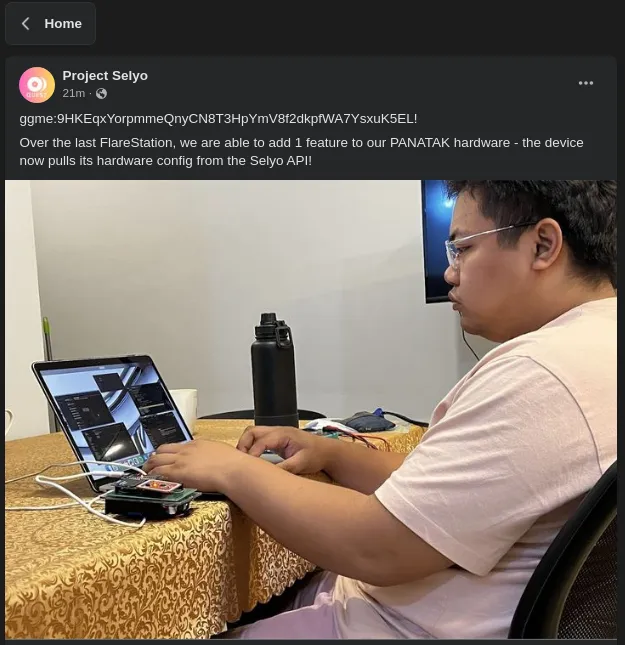
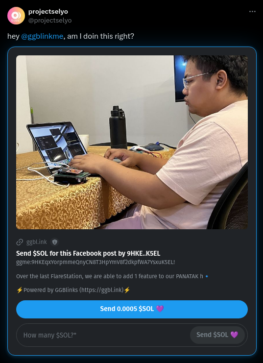

# ggblinks
Convert your post into Blinks. [Try it now](https://ggbl.ink/)

## What is GGBlinks?
GGBlinks converts your social-media posts from Facebook, Tiktok, YouTube, etc to a Blink-enabled post -- opening for Web3-powered possibilities like sending tokens, creating airdrops, minting NFTs, and many more in the future!

It will convert your social media post like this

Into something like this

## How does it work?
For a social-media post to be GGBlink-ified, you must use a gg tag

The default gg tag is `ggme`. The format is `ggtag:WALLET_OR_PUBLIC_KEY!`
**Impt!!!: don't forget the exclamation point**

For example, to enable people to send you $SOL in the Blink to be generated, you can include the following text in your post. It is recommended to put this gg tag in the beginning of your posts content.

Example: 
> "ggme:9D4sJ6tB2sBtELmFcMewJShNGWHwUAgmsfxpnYZeW6cG! gimme some SOL"

You can also use **SNS (.sol) names** and **AllDomains** names such as k1merran.sol and ggme.blink

For example:

> "ggme:k1merran.sol! Yeah, that is using an SNS instead of wallet address"

Once your content contains these gg tag, you can convert your post into GGBlink by appending https://ggbl.ink in the beginning of your post's URL. 

For example if your Facebook post is
> https://facebook.com/some-post-url

your GGBlink will be 
> https://ggbl.ink/https://facebook.com/some-post-url

## Contacts
Telegram: @k1merran

Social media of GGBlinks: @ggblinkme